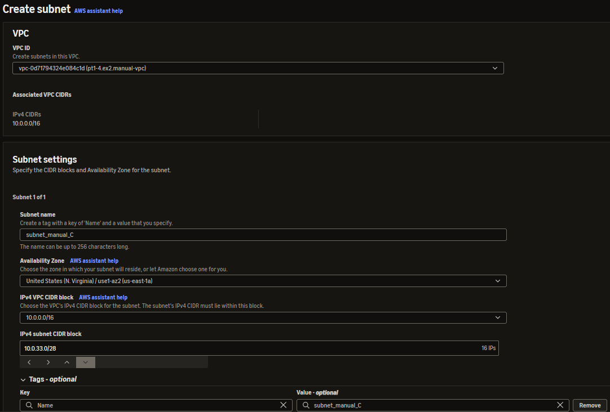
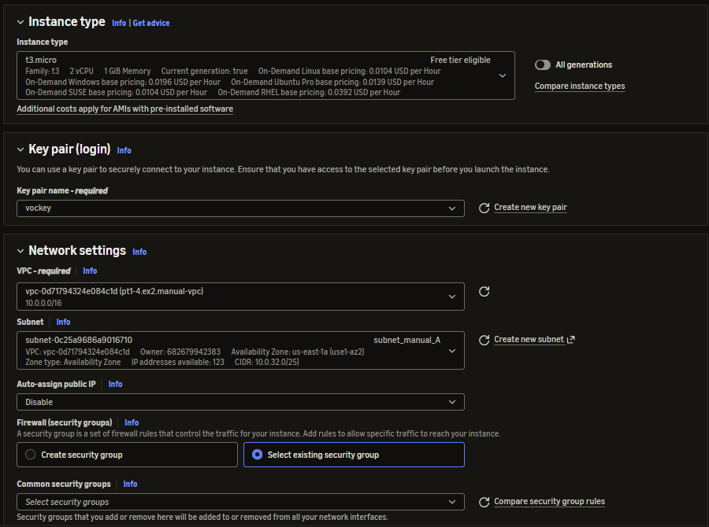
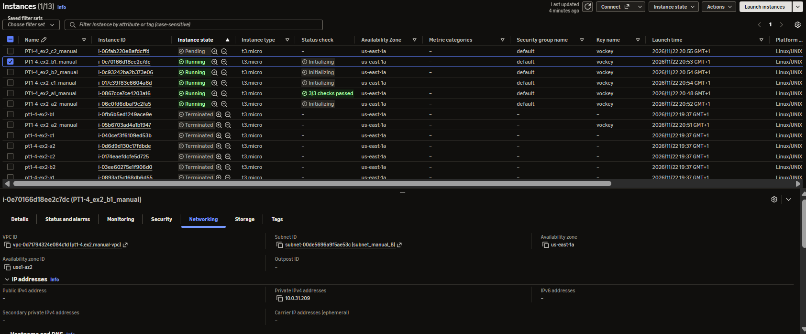
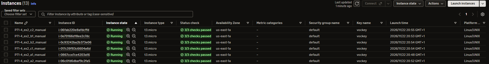
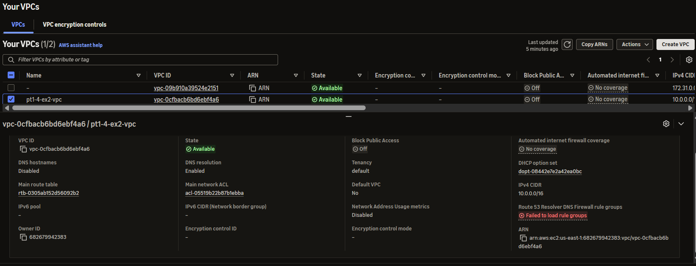
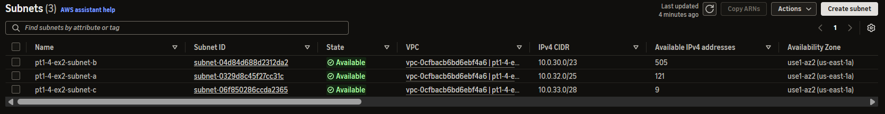
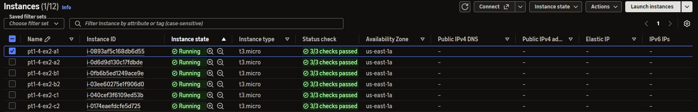

# Ejercicio 2 — Diseño y despliegue de VPC, subredes y EC2

## Objetivo

Comprender la segmentación de redes en AWS mediante una VPC con tres subredes y
comparar dos formas de despliegue:

- **Parte B:** despliegue manual desde la consola de AWS.
- **Parte C:** despliegue automatizado con Terraform.

Las tres subredes se encuentran en la misma zona de disponibilidad (`us-east-1a`) y
en cada una se despliegan dos instancias EC2 `t3.micro` con Amazon Linux 2023, hasta
un total de **6 instancias**.

El diseño es de subredes privadas: no se asigna IP pública a las instancias y no se
declara Internet Gateway ni tabla de rutas hacia Internet.

## Diseño de red

| Subred | CIDR | Zona | Instancias |
|---|---|---|---|
| Subred A | `10.0.32.0/25` | `us-east-1a` | 2 |
| Subred B | `10.0.30.0/23` | `us-east-1a` | 2 |
| Subred C | `10.0.33.0/28` | `us-east-1a` | 2 |
| **Total** | **VPC `10.0.0.0/16`** | | **6** |

Los rangos no se solapan:

- Subred A: `10.0.32.0` — `10.0.32.127`
- Subred B: `10.0.30.0` — `10.0.31.255`
- Subred C: `10.0.33.0` — `10.0.33.15`

Todas las subredes pertenecen a la VPC `10.0.0.0/16` y están en `us-east-1a`.

## Topología


El diagrama editable se encuentra en
[`assets/topologia.drawio`](assets/topologia.drawio) y se ha exportado a
[`assets/topologia.drawio.png`](assets/topologia.drawio.png).

## Parte A — Diseño de la red

La infraestructura se ha diseñado con estos criterios:

- Una VPC principal con bloque `10.0.0.0/16`.
- Tres subredes de tamaños diferentes para practicar el cálculo de CIDR.
- Las tres subredes en la misma zona de disponibilidad (`us-east-1a`).
- Dos instancias EC2 por subred, con un total de seis.
- Sin solapamientos entre subredes.
- Sin IP pública en las instancias.
- Sin Internet Gateway ni tabla de rutas pública.
- Sin reglas de entrada SSH.

## Parte B — Despliegue manual en la consola de AWS

El despliegue manual se realiza **íntegramente desde la consola de AWS**, sin
utilizar la terminal.

### 1. Crear la VPC

Ir a **VPC → Your VPCs → Create VPC**:

- Nombre: `pt1-4-ex2-vpc`.
- Bloque IPv4 CIDR: `10.0.0.0/16`.
- Sin subredes automáticas, sin Internet Gateway.


### 2. Crear las subredes

Ir a **VPC → Subnets → Create subnet**, seleccionar la VPC `pt1-4-ex2-vpc` y crear
tres subredes en la zona `us-east-1a`:

- `pt1-4-ex2-subnet-a` → `10.0.32.0/25`
- `pt1-4-ex2-subnet-b` → `10.0.30.0/23`
- `pt1-4-ex2-subnet-c` → `10.0.33.0/28`

En **Actions → Modify auto-assign IP settings** de cada subred, dejar
**Auto-assign public IPv4 = Disable** (son subredes privadas).


Detalle de cada subred:




### 3. Lanzar las instancias EC2

Ir a **EC2 → Instances → Launch instances**. Como ejemplo se muestra el proceso
completo para crear la primera instancia (`a1`); el resto (`a2`, `b1`, `b2`, `c1`,
`c2`) siguen exactamente los mismos pasos, cambiando solo el nombre y la subred.

**Parte 1 — Configuración inicial:**

- Nombre: `pt1-4-ex2-a1`.
- AMI: **Amazon Linux 2023 (x86_64)**.
- Tipo de instancia: `t3.micro`.
- Par de claves: el disponible en el laboratorio (`vockey`).
- Red: VPC `pt1-4-ex2-vpc` y subred `pt1-4-ex2-subnet-a`.
- **No** marcar la opción de asignar IP pública (subred privada).


**Parte 2 — Revisión y lanzamiento:**

- Revisar el resumen de configuración.
- Pulsar **Launch instance**.



Una vez creada la primera, se repite el proceso para las otras cinco instancias,
asignando a cada una su subred correspondiente:

| Instancia | Subred |
|---|---|
| `pt1-4-ex2-a1` | `pt1-4-ex2-subnet-a` |
| `pt1-4-ex2-a2` | `pt1-4-ex2-subnet-a` |
| `pt1-4-ex2-b1` | `pt1-4-ex2-subnet-b` |
| `pt1-4-ex2-b2` | `pt1-4-ex2-subnet-b` |
| `pt1-4-ex2-c1` | `pt1-4-ex2-subnet-c` |
| `pt1-4-ex2-c2` | `pt1-4-ex2-subnet-c` |

Detalle de cada instancia creada:





### 4. Comprobar el resultado

En **EC2 → Instances** se verifica que las seis instancias están en estado
`Running`, cada una en su subred, con IP privada dentro del rango de su subred y
**sin IP pública**.



En **VPC → Your VPCs** y **VPC → Subnets** se comprueba que la VPC y las tres
subredes existen con los CIDR indicados y `Auto-assign public IPv4 = Disable`.

> En la consola de AWS no se crean recursos por terminal. Los pasos anteriores
> describen únicamente acciones de la interfaz web de AWS.

## Parte C — Despliegue con Terraform

### Estructura del proyecto

```text
pt1-4-ex2/
├── assets/
│   ├── topologia.drawio
│   ├── topologia.drawio.png
│   ├── vpc_teraform.png
│   ├── subnet_teraform.png
│   └── instancias_teraform.png
├── main.tf
└── README.md
```

### Código Terraform

`main.tf` declara explícitamente la VPC, las tres subredes y las seis instancias.
Cada instancia tiene asignada su subred mediante `subnet_id`.

```hcl
resource "aws_vpc" "this" {
  cidr_block = "10.0.0.0/16"
}

resource "aws_subnet" "a" {
  vpc_id            = aws_vpc.this.id
  cidr_block        = "10.0.32.0/25"
  availability_zone = "us-east-1a"
}

resource "aws_instance" "a1" {
  ami           = "ami-04b938437b69a2c9c"
  instance_type = "t3.micro"
  subnet_id     = aws_subnet.a.id
}
```

El resto de subredes e instancias siguen el mismo patrón:

| Instancia | Subred asignada |
|---|---|
| `a1`, `a2` | Subred A |
| `b1`, `b2` | Subred B |
| `c1`, `c2` | Subred C |

El enunciado menciona `main.tf`, `variables.tf`, etc. En esta entrega se ha mantenido
un único `main.tf` con valores explícitos, sin variables ni outputs, para respetar el
alcance mínimo solicitado.

### Despliegue

```bash
terraform init
terraform fmt -check
terraform validate
terraform plan -out=tfplan
terraform apply tfplan
```

## Resultados del despliegue Terraform

Infraestructura desplegada y verificada en `us-east-1`.

| Recurso | Nombre | ID |
|---|---|---|
| VPC | `pt1-4-ex2-vpc` | `vpc-0cfbacb6bd6ebf4a6` |

Subredes:

| Subred | Nombre | CIDR | ID |
|---|---|---|---|
| A | `pt1-4-ex2-subnet-a` | `10.0.32.0/25` | `subnet-0329d8c45f27cc31c` |
| B | `pt1-4-ex2-subnet-b` | `10.0.30.0/23` | `subnet-04d84d688d2312da2` |
| C | `pt1-4-ex2-subnet-c` | `10.0.33.0/28` | `subnet-06f850286ccda2365` |

Instancias:

| Instancia | Nombre | Subred | ID | IP privada | IP pública | Estado |
|---|---|---|---|---|---|---|
| `a1` | `pt1-4-ex2-a1` | A | `i-0893af5c168db6d55` | `10.0.32.64` | — | `running` |
| `a2` | `pt1-4-ex2-a2` | A | `i-0d6d9d130c17fdbde` | `10.0.32.8` | — | `running` |
| `b1` | `pt1-4-ex2-b1` | B | `i-0fb6b5ed1249ace9e` | `10.0.31.79` | — | `running` |
| `b2` | `pt1-4-ex2-b2` | B | `i-03ee60275e1f906d0` | `10.0.31.215` | — | `running` |
| `c1` | `pt1-4-ex2-c1` | C | `i-040cef3f6109ed53b` | `10.0.33.8` | — | `running` |
| `c2` | `pt1-4-ex2-c2` | C | `i-0174eaefdcfe5d725` | `10.0.33.7` | — | `running` |

Comprobaciones realizadas:

- `terraform validate` correcto.
- `terraform apply` completado: **10 recursos creados**.
- `terraform plan` posterior: **sin cambios** (infraestructura idempotente).
- Las 6 instancias en `running` y con los chequeos `2/2` en `ok`.
- Ninguna instancia tiene IP pública.
- Las 6 instancias usan `t3.micro` y la AMI `ami-04b938437b69a2c9c`.
- Todos los recursos tienen etiqueta `Name`.

### Capturas del despliegue con Terraform







## Verificación

Desde la consola de AWS:

- **VPC → Your VPCs** para ver `pt1-4-ex2-vpc` con CIDR `10.0.0.0/16`.
- **VPC → Subnets** para ver las tres subredes con sus CIDR y
  `Auto-assign public IPv4 = Disable`.
- **EC2 → Instances** para ver las seis instancias en estado `running`, cada una en
  su subred y sin IP pública.

Desde la terminal, la comprobación se puede repetir con AWS CLI:

```bash
aws ec2 describe-instances \
  --region us-east-1 \
  --filters "Name=vpc-id,Values=vpc-0cfbacb6bd6ebf4a6" \
  --query "Reservations[].Instances[].{ID:InstanceId,Estado:State.Name,Tipo:InstanceType,Subred:SubnetId,IPPrivada:PrivateIpAddress,IPPublica:PublicIpAddress}" \
  --output table
```

## Comparación: consola vs. Terraform

| Aspecto | Consola de AWS | Terraform |
|---|---|---|
| Velocidad inicial | Rápida para pocos recursos | Requiere escribir el código |
| Reproducibilidad | Manual, depende de los pasos | Alta, el código se repite |
| Errores humanos | Fáciles de cometer | Menores, validados con `plan` |
| Versionado | No | Sí, en Git |
| Cambios | Manuales | `terraform plan` + `apply` |
| Eliminación | Manual, recurso a recurso | `terraform destroy` |

## Limpieza de recursos

Para evitar cargos, se puede destruir toda la infraestructura:

```bash
terraform plan -destroy
terraform destroy
```

El `destroy` elimina las seis instancias, las subredes y la VPC.

## Decisiones y limitaciones

- **Misma AZ:** las tres subredes están en `us-east-1a` para cumplir el enunciado.
- **Subredes privadas:** no se declara Internet Gateway ni tabla de rutas pública.
  Las instancias no tienen IP pública.
- **Alcance mínimo:** Terraform crea únicamente la VPC, las tres subredes y las seis
  instancias. No se declaran Security Groups, key pairs, variables ni outputs.
- **AMI fijada:** el ID `ami-04b938437b69a2c9c` corresponde a una AMI de Amazon Linux
  2023 de `us-east-1`. Si deja de estar disponible, hay que actualizar el ID.
- **Estado local:** se utiliza `terraform.tfstate` local. No debe versionarse.
- **Coste:** seis instancias `t3.micro` encendidas 24/7 pueden superar el nivel
  gratuito. Hay que ejecutar `terraform destroy` al terminar.
- **IPs privadas:** las IPs asignadas pueden cambiar si las instancias se recrean.

## Conclusión

El despliegue manual permite entender la creación de cada recurso desde la consola,
mientras que Terraform permite reproducir la misma infraestructura de forma más
rápida y controlada. La VPC queda segmentada en tres subredes dentro de la misma zona
de disponibilidad, con dos instancias EC2 en cada una y sin exposición pública.